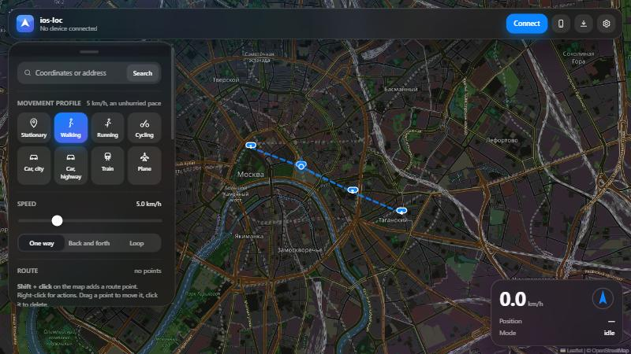
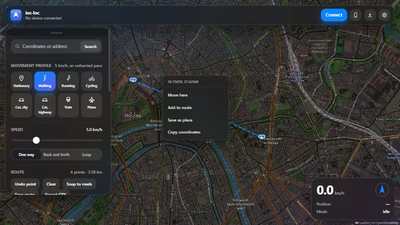
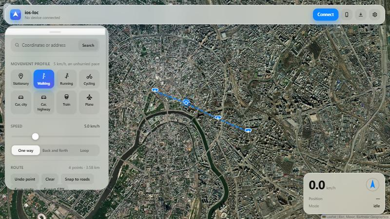
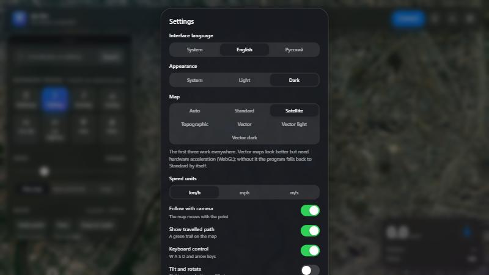
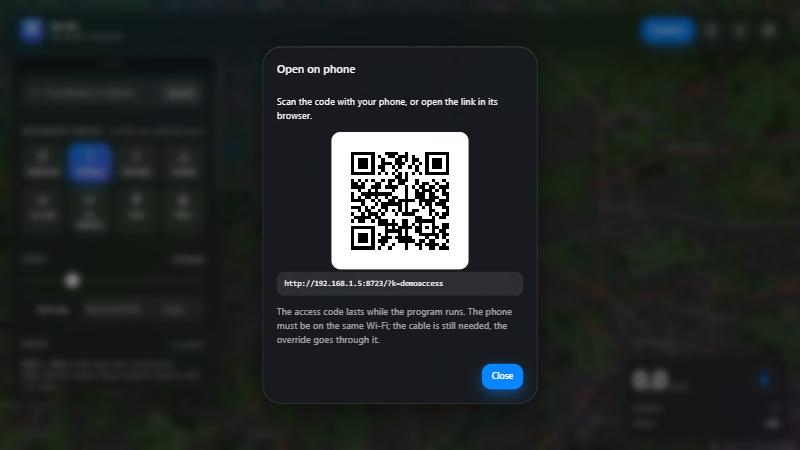

<div align="center">


# iphone-fake-gps

**Fake GPS for iPhone, driven from Windows over the cable.**

Set any location, or travel a route at a believable pace. Built on Apple's own
developer services — no jailbreak, no patching, no configuration profiles.

<sub>The program and its command are called `ios-loc`.</sub>



</div>

---

## What it does

Puts an iPhone anywhere on the map, and can drive it along a route — walking,
by car, by train or by plane — with believable acceleration and GPS scatter.

It uses the same mechanism as Xcode's **Simulate Location**
(`com.apple.instruments.server.services.LocationSimulation`), reached over
usbmuxd, the transport Finder and Xcode already use.

* **Click the map** to move the device there. No modes to toggle.
* **Shift-click** to build a route; drag a point to move it, click it to delete.
* **Movement profiles** — stationary, walking, running, cycling, city driving,
  highway, train, plane. Each has its own cruise speed, acceleration curve, GPS
  jitter and turn rate.
* **Routes** can be drawn, snapped to roads, imported from GPX, exported to GPX
  and saved by name.
* **Manual control** with W A S D or the arrow keys, with smooth turning.
* **Five map styles** on two engines — raster maps that work anywhere, vector
  maps where WebGL is available.
* **English and Russian** interface, light and dark themes.
* **Works without the cable** over Wi-Fi, and the panel itself can be opened
  **on the phone**.

---

## Requirements

| | |
|---|---|
| **Windows 10/11** | tested on Windows 10 Pro 19045 |
| **Apple Mobile Device Support** | **required** — install Apple Devices from the Microsoft Store, or iTunes from apple.com |
| **iPhone with iOS 13+** | iOS 17 and newer connect through a RemoteXPC tunnel, handled automatically |
| **Python 3.9+** | only to run from source; the packaged build needs nothing |

Windows cannot talk to an iPhone on its own — the Apple driver is what makes the
USB transport exist. Everything else the program brings with it.

### iOS 16 and newer: Developer Mode

On the iPhone: **Settings → Privacy & Security → Developer Mode** → on.
The device restarts and asks you to confirm.

**That entry is missing on a fresh device, and that is expected** — iOS hides it
until a development tool has talked to the phone. Press **"I don't see Developer
Mode"** in the device list, or run `ios-loc.exe devmode`, and it appears.

---

## Install

Grab the archive from [Releases](../../releases), unpack it anywhere and run
`ios-loc.exe`. Python is not needed.

Windows SmartScreen will warn about an unsigned executable — code-signing
certificates cost money. **More info → Run anyway.**

<details>
<summary>Running from source</summary>

```bash
git clone <this repo>
cd ios-loc
python -m venv .venv
.venv\Scripts\python.exe -m pip install -r requirements.txt
.venv\Scripts\python.exe -m iosloc ui
```

If installation fails building `lzfse`: it is a C extension with no wheels,
pulled in transitively by `ipsw_parser`, and only used for IPSW firmware — which
this project never touches. Either install MSVC Build Tools, or use the stub:

```bash
.venv\Scripts\python.exe -m pip install tools\lzfse-stub
```

</details>

---

## Using it

Run `ios-loc.exe`, press **Connect**, pick the device. Then click the map.

| Action | How |
|---|---|
| Move the device | click the map, or drag the blue puck |
| Add a route point | **Shift + click** |
| Edit a route point | drag it; click it to delete |
| Map actions | **right-click** — move here, add to route, save place, copy coordinates |
| Travel the route | **Start moving** |
| Change profile | click it, or press **1**–**8** |
| Pause | **space** |
| Free roam | **W A S D** / arrow keys, **Shift** to speed up |

The camera follows the device, but pan the map by hand and it stops following —
a **Back to device** button appears to return.



### Maps

Five styles on two engines, chosen in settings:

| Style | Engine | Needs WebGL | Source |
|---|---|---|---|
| Standard | Leaflet (raster) | no | OpenStreetMap |
| Satellite | Leaflet (raster) | no | Esri World Imagery |
| Topographic | Leaflet (raster) | no | OpenTopoMap |
| Vector / Vector light | MapLibre | **yes** | OpenFreeMap |
| Vector dark | MapLibre | **yes** | VersaTiles |

**Auto** picks a vector map where WebGL is available and a raster one where it is
not. If a vector map fails to render within ten seconds, the program falls back
to Standard by itself and says so, instead of showing a black rectangle. None of
these sources needs an API key.



### Settings



Interface language, theme, map style, speed units, camera follow, travelled path,
keyboard control, tilt and rotate, and online services. All of it persists
between runs.

**Online services are off by default.** Address search (Nominatim) and road
routing (OSRM) send queries to public OpenStreetMap servers; while the switch is
off, no coordinates leave the machine. Map tiles are a separate matter — the
browser fetches those directly, and without internet the map is simply blank
while everything else keeps working.

### Without the cable

Connect by USB once and run:

```bash
ios-loc.exe wifi
```

That enables wireless lockdown — the same capability Wi-Fi sync uses. Afterwards
the cable can come out: while the phone and the computer are on the same network
the device shows up marked `Network` and everything works as before. Turn it
back off with `ios-loc.exe wifi --off`.

The cable is still more reliable. Wi-Fi is slower and drops when the phone
sleeps, so a long route is better done wired.

### Driving it from the phone

```bash
ios-loc.exe ui --lan
```

The program prints an address, an access code and a QR code; the same QR is in
the panel, behind the phone icon. Scan it and the panel opens in the phone's
browser.



**On security.** A normal run binds `127.0.0.1` only. `--lan` exposes the panel
to the whole network — and the panel controls a phone's location — so in that
mode **every request requires the access code**. The code is random, new on each
run, and lives only while the program does; without it the server answers 401 to
everything, including a location change. Do not use this mode on a public or
untrusted network.

---

## What this does not do

* **Steps and Health are untouched.** The step counter comes from the motion
  coprocessor through `CMPedometer`, not from CoreLocation, and Apple exposes no
  motion-simulation service. Nothing can write to HealthKit over a cable either —
  only an app on the device can, with the user's permission. Anything measuring
  **distance by GPS** (running and cycling trackers, Outdoor Run / Cycle
  workouts) does work.
* **Only coordinates change.** Altitude, accuracy, speed and course are computed
  by iOS from the sequence of coordinates. That is exactly why the movement
  profiles use realistic speeds.
* **Apps can tell.** iOS marks simulated locations, and apps can check. Games and
  location-based services generally ban accounts for it.
* **Emergency calls** locate the device by other means and are unaffected.
* **The override lasts only while the program runs.** Close it, unplug the cable
  or reboot the phone and the real location returns. That is how Apple's
  mechanism works, so the window has to stay open — it can live in the tray.

---

## Troubleshooting

Start here — it checks the driver, the device, Developer Mode and the integrity
of the program itself:

```bash
ios-loc.exe doctor
```

| Symptom | Fix |
|---|---|
| `usbmuxd: UNAVAILABLE` | Install Apple Devices or iTunes; check the Apple Mobile Device Service in `services.msc` |
| No "Trust This Computer?" prompt | Unlock the iPhone, reconnect the cable, try another port or cable |
| Developer Mode entry missing | Press "I don't see Developer Mode", or run `ios-loc.exe devmode` |
| `Could not mount the Developer Disk Image` | Unlock the phone, keep the cable in; the image downloads from Apple, so internet is needed |
| Tunnel fails on iOS 17+ | `pip install -U pymobiledevice3` and rebuild, or run `pymobiledevice3 remote tunneld` as administrator |
| Map does not render | Pick **Standard** in settings — vector maps need WebGL |
| A position does not update in one app | Close and reopen it; many cache the last known location |

---

## How it works

```
iosloc/
  geo.py        spherical geometry: distances, bearings, interpolation
  route.py      Track plus the movement engines, with acceleration ramps
  profiles.py   movement profiles: speed, acceleration, jitter, turn rate
  device.py     USB/Wi-Fi link, iOS 17+ tunnel, DDI mounting, location channel
  session.py    the controller: one device, one runner, one pump task
  server.py     local HTTP API and the panel
  access.py     LAN access: token, addresses, QR
  i18n.py       message translation
  cli.py        command line
  static/       the panel: HTML, CSS, JS, both map engines, styles and icons
tools/
  make_icon.py       draws the icon (PNG set + .ico)
  make_map_styles.py fetches the vector map styles
  make_release.py    builds the distributable archive and verifies it
tests/
  test_core.py  58 tests
```

The path to the device differs by iOS version, and `device.py` hides it:

* **iOS 13–16** — developer services are reachable over plain lockdown.
* **iOS 17+** — they moved behind RemoteXPC and need a tunnel. The userspace
  (PyTCP) tunnel is used, so no administrator rights and no TUN driver are
  required; `tunneld` is the fallback.

Movement is computed on the server: every profile interval the engine advances,
produces a coordinate and pushes it to the device. The browser only polls state
and interpolates the marker between two consecutive fixes, which is why motion
looks continuous although fixes arrive once a second.

### Tests

```bash
.venv\Scripts\python.exe -m unittest discover -s tests -v
```

No device needed: the USB link is replaced by a recorder, and the tests assert on
exactly the coordinates the tool would have sent over the cable.

### Building the archive

```bash
.venv\Scripts\python.exe tools\make_release.py
```

Redraws the icon, freezes the app with PyInstaller, verifies that the frozen
build can import everything it needs, and packs it. The verification exists
because a missing `wintun.dll` and a missing `pyimg4` dist-info each shipped once
before it did.

---

## License

GPL-3.0-or-later — see [LICENSE](LICENSE).

This is not a choice of style: [pymobiledevice3](https://github.com/doronz88/pymobiledevice3),
which implements the Apple protocols underneath, is GPL-3.0, and anything built
on it inherits that. `pystray` is LGPL-3.0; the remaining dependencies are MIT,
BSD or Apache-2.0.

Map data © OpenStreetMap contributors. Satellite imagery © Esri, Maxar,
Earthstar Geographics. Topographic tiles © OpenTopoMap (CC-BY-SA).
